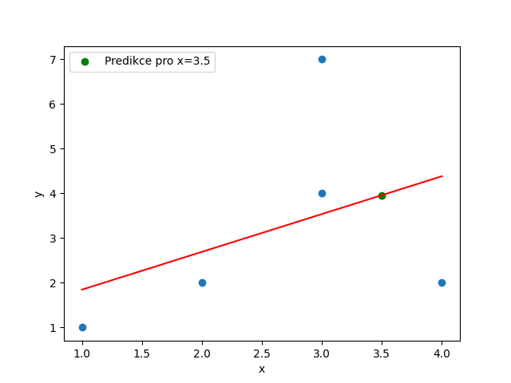
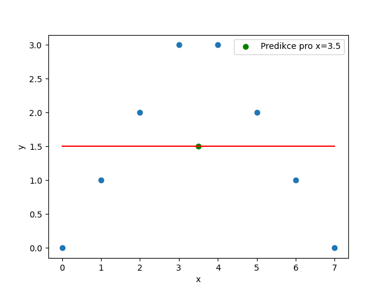
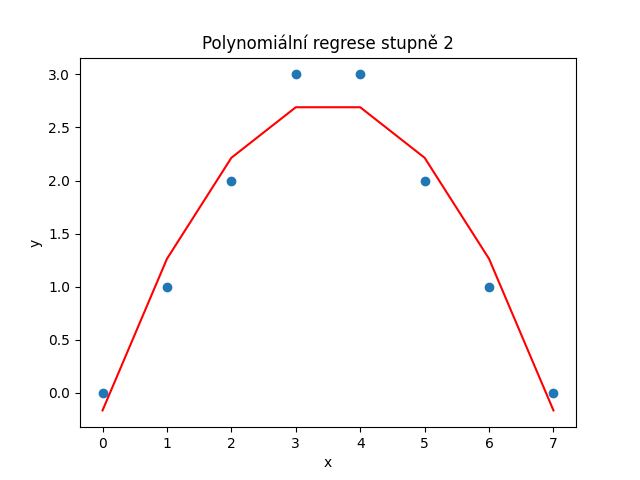

# Regresní analýza

Regresní analýza hledá křivku s co nejmenší chybou oproti daným bodům.
U regresních analýz je důležité mít představu o výstupu, abychom zvolili správnou metodu..

## Lineární regresní analýza

V `linear.py` uděláme lineární analýzu:

Ta však selže, pokud vyjádření přimkou nedává smysl:

## Polynomiální regresní analýza

Ta nám dovoluje mít složitější křivku:

